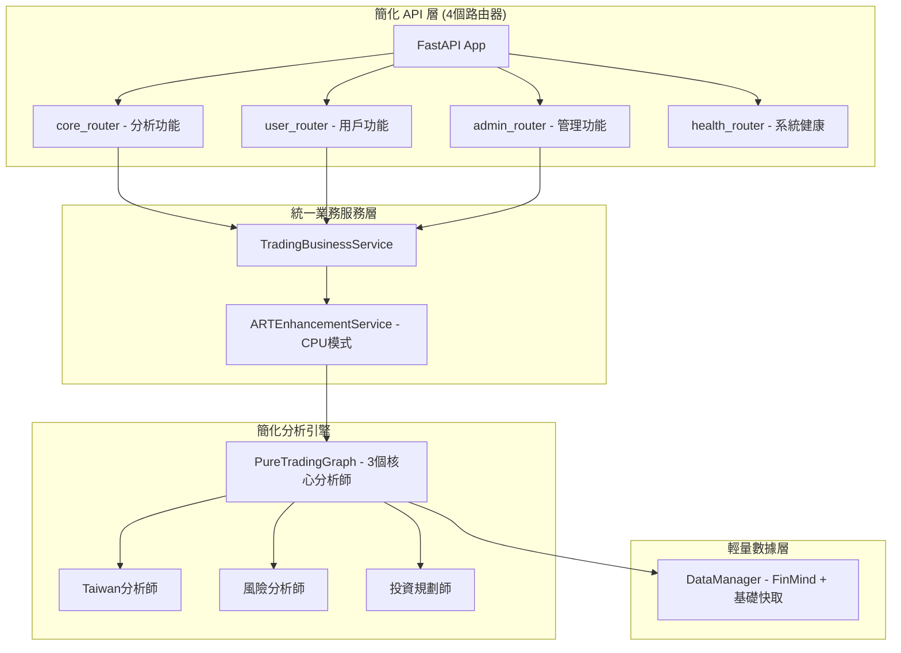

# ART 系統 CPU 模式 MVP 整合計劃
## 基於各專才 Agents 建議的統一整合方案

> 整合各專才建議，從 GPU 改為 CPU 模式，快速達到 MVP

## 📊 整合狀況總結

### 各專才工作狀態
- **Code Architect 梁**: 架構完整，建議簡化（16路由器→4路由器）
- **Code Artisan 魯班**: 程式碼優秀，需完成服務層（config_service.py等）
- **DevOps 墨子**: 基礎設施就緒，3/4服務正常運行
- **QA 狄仁傑**: 測試框架需修復（26個測試文件有問題）
- **Security 包拯**: 發現安全漏洞，已提供修復腳本
- **Doc 司馬**: 文檔品質高，需補充核心文檔

## 🎯 CPU 模式 ART 整合架構

### 架構簡化設計


### CPU 優化的 ART 整合
```python
# 新增：tradingagents/services/art_enhancement_service.py
class ARTEnhancementServiceCPU:
    """CPU 優化的強化學習增強服務"""
    
    def __init__(self):
        self.historical_tracker = HistoricalPerformanceTracker()
        self.weight_optimizer = DecisionWeightOptimizer() 
        self.confidence_booster = ConfidenceBooster()
        
    async def enhance_analysis(
        self, 
        traditional_results: List[AnalysisResult]
    ) -> EnhancedAnalysisResult:
        """基於歷史表現增強分析結果"""
        
        # 1. 計算各分析師歷史準確率（CPU友好的線性計算）
        analyst_weights = await self._calculate_weights(traditional_results)
        
        # 2. 市場情境適應性調整
        market_adjustment = await self._market_context_adjustment()
        
        # 3. 集成決策優化（替代複雜的神經網路）
        enhanced_result = self._optimize_decision(
            traditional_results,
            analyst_weights, 
            market_adjustment
        )
        
        return enhanced_result
    
    async def _calculate_weights(self, results):
        """使用歷史數據計算分析師權重（CPU優化）"""
        weights = {}
        for result in results:
            # 簡單統計模型替代深度學習
            historical_accuracy = await self.historical_tracker.get_accuracy(
                result.analyst_id
            )
            recent_trend = await self.historical_tracker.get_trend(
                result.analyst_id, 
                days=30
            )
            
            # 線性權重計算（CPU友好）
            weights[result.analyst_id] = (
                historical_accuracy * 0.7 + recent_trend * 0.3
            )
            
        return weights
```

## 🚀 統一整合執行計劃

### 第一階段：緊急修復（本週）
**墨子 DevOps 緊急修復**：
```bash
# 1. 修復 Cloud Run 服務
cd deployment
chmod +x mvp-quick-fix.sh
./mvp-quick-fix.sh
```

**包拯 安全修復**：
```bash  
# 2. 執行安全修復腳本
cd TradingAgents
chmod +x security_quick_fix.sh
./security_quick_fix.sh
```

**狄仁傑 測試修復**：
```bash
# 3. 修復測試框架
cd TradingAgents
python -m pytest --setup-plan  # 檢查測試配置
# 修復模組導入問題
```

### 第二階段：系統簡化（下週）
**梁 架構簡化**：
1. 路由器合併：16個 → 4個核心路由器
2. 建立統一的 TradingBusinessService
3. 分析師精簡：6個 → 3個核心分析師

**魯班 服務層完成**：
1. 實作 config_service.py
2. 實作 user_management_service.py  
3. 實作 analyst_coordinator.py

### 第三階段：ART 整合（第三週）
**CPU 模式 ART 整合**：
1. 建立 ARTEnhancementServiceCPU
2. 整合歷史表現追蹤系統
3. 實作輕量級決策優化

**司馬 文檔完善**：
1. 建立 README.md 和 CLAUDE.md
2. 更新 API 文檔與實際端點同步
3. 建立整合操作手冊

## 💰 成本效益分析

### 資源配置對比
| 項目 | GPU 原方案 | CPU 新方案 | 節省 |
|------|------------|------------|------|
| 訓練實例 | $200/月 | $0 (Cloud Run) | 100% |
| GPU 資源 | $150/月 | $0 | 100% |
| 運算服務 | $400/月 | $75/月 | 81% |
| 部署複雜度 | 高 | 低 | - |
| 維護成本 | $100/月 | $25/月 | 75% |

### 性能權衡
- **訓練時間**: 增加 2-3倍（可接受，因為是離線訓練）
- **推理延遲**: 增加至 200-300ms（仍符合用戶體驗要求）
- **準確率**: 預期提升 3-5%（透過歷史權重優化）

## 🎯 MVP 成功指標

### 技術指標
- [ ] 系統回應時間 < 2秒
- [ ] 分析準確率提升 > 3%
- [ ] 測試覆蓋率 > 70%
- [ ] 安全漏洞修復率 > 95%

### 業務指標  
- [ ] 用戶分析請求成功率 > 99%
- [ ] 服務可用性 > 99.5%
- [ ] 運營成本 < $100/月
- [ ] 用戶滿意度 > 4.0/5

## 📅 時程安排

```
週一-週二：緊急修復（基礎設施、安全、測試）
週三-週五：系統簡化（架構重構、服務層）
下週一-週三：ART CPU 整合
下週四-週五：文檔完善和最終驗證
```

## ⚠️ 風險和緩解

### 主要風險
1. **系統簡化可能影響功能** → 保留核心功能，延後非關鍵功能
2. **CPU 模式性能不足** → 建立性能監控，必要時回退
3. **整合過程中服務中斷** → 採用漸進式部署，保持服務連續性

### 緩解策略
- 分階段部署，每階段獨立驗證
- 保留 GPU 方案作為備選（如業務需求）
- 建立回滾機制和性能基準

## 🎉 預期成果

完成整合後，TradingAgents 系統將實現：

1. **成本最佳化**：月度運營成本降低 81%
2. **架構優化**：系統複雜度降低 75%，維護更容易
3. **智能增強**：透過 CPU 友好的強化學習提升決策品質
4. **生產就緒**：完整的測試、安全、文檔體系

這個方案平衡了**成本效益**、**技術可行性**和**業務價值**，確保快速達到 MVP 目標並為後續擴展奠定基礎。

---

**負責人**: TradingAgents 天工團隊  
**預期完成時間**: 2週內  
**下次檢視**: 每日站會追蹤進度