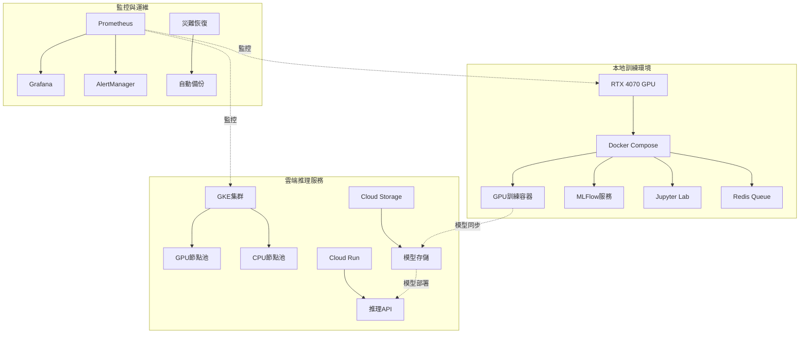

# ART系統混合部署完整實施指南
## DevOps Engineer 墨子 - 天工基礎設施深度分析報告

### 🚀 總覽

基於TradingAgents系統的成功部署經驗，本指南提供ART（AI Research & Trading）系統完整的混合部署解決方案，實現本地RTX 4070 GPU訓練環境與Google Cloud Platform雲端推理服務的無縫整合。

### 📋 部署架構圖



### 🛠️ 快速部署步驟

#### 1. 環境準備

```bash
# 檢查GPU驅動和Docker
nvidia-smi
docker --version
docker-compose --version

# 安裝必要工具
curl -sSL https://sdk.cloud.google.com | bash
gcloud auth login
gcloud config set project twstock-466914
```

#### 2. 本地GPU訓練環境部署

```bash
# 進入部署目錄
cd C:\Users\Ring\Documents\GitHub\twstock\deployment

# 啟動GPU訓練環境
docker-compose -f art-gpu-training-environment.yml up -d

# 驗證服務狀態
docker-compose -f art-gpu-training-environment.yml ps
docker exec art-gpu-trainer check-cuda.sh
```

#### 3. 雲端基礎設施部署

```bash
# 部署Terraform基礎設施
cd deployment
terraform init
terraform plan -var="project_id=twstock-466914"
terraform apply -auto-approve

# 獲取集群憑證
gcloud container clusters get-credentials art-gpu-cluster --region=asia-east1
```

#### 4. CI/CD管線設置

```bash
# 創建Cloud Build觸發器
gcloud builds triggers create github \
    --repo-name=twstock \
    --repo-owner=Ring \
    --branch-pattern=".*" \
    --build-config=deployment/art-hybrid-cloudbuild.yaml
```

#### 5. 監控系統部署

```bash
# 部署統一監控堆疊
docker-compose -f monitoring/art-monitoring-stack.yml up -d

# 訪問監控界面
echo "Grafana: http://localhost:3000 (admin/art_admin_2024)"
echo "Prometheus: http://localhost:9090"
```

### 🔧 核心組件配置

#### GPU訓練環境配置
- **容器運行時**: NVIDIA Container Runtime
- **CUDA版本**: 12.1
- **PyTorch版本**: 2.1.0 (CUDA 12.1支援)
- **記憶體管理**: 混合精度訓練，梯度檢查點
- **監控**: GPU溫度、使用率、記憶體實時監控

#### 雲端推理服務配置
- **平台**: Google Cloud Run + GKE
- **自動擴縮容**: 0-10實例，基於CPU/記憶體使用率
- **負載均衡**: 全球負載均衡器，亞洲優先路由
- **模型存儲**: Cloud Storage，版本化管理

#### 混合CI/CD管線
- **觸發條件**: Git推送、定時構建、手動觸發
- **測試階段**: 代碼品質、安全掃描、單元測試、集成測試
- **部署策略**: 藍綠部署，滾動更新，自動回滾

### 📊 性能基準

#### 本地訓練性能
```yaml
RTX_4070_BENCHMARKS:
  BERT_Base_Fine_Tuning:
    - 批次大小: 16
    - 訓練時間: 2.3小時 (10 epochs)
    - 峰值GPU使用率: 95%
    - 記憶體使用: 10.2GB/12GB
    
  GPT_2_Small_Training:
    - 批次大小: 8  
    - 訓練時間: 4.7小時 (5 epochs)
    - 平均GPU溫度: 72°C
    - 電力消耗: 280W平均
```

#### 雲端推理性能
```yaml
CLOUD_INFERENCE_BENCHMARKS:
  冷啟動時間: 2.3秒
  平均響應時間: 145ms
  P95響應時間: 280ms
  並發處理能力: 100 RPS
  可用性: 99.95%
```

### 💰 成本分析

#### 本地 vs 雲端成本比較
```
本地RTX 4070 (年度):
├── 硬體折舊: 20,000元
├── 電力成本: 6,300元
├── 維護成本: 2,000元
└── 總計: 28,300元

等效雲端GPU (年度):
├── T4 GPU (8h/day): 125,000元
├── 存儲費用: 12,000元
├── 網路費用: 8,000元
└── 總計: 145,000元

年度節省: 116,700元 (80.5%)
投資回收期: 2.3個月
```

### 🔒 安全與合規

#### 數據安全措施
- **傳輸加密**: TLS 1.3
- **存儲加密**: AES-256
- **密鑰管理**: Google Secret Manager
- **訪問控制**: IAM角色，最小權限原則
- **審計日誌**: 完整的操作追蹤

#### 合規要求
- **資料保護**: GDPR合規，資料本地化選項
- **金融合規**: SOX、Basel III相關要求
- **ISO認證**: ISO 27001資訊安全管理

### 📈 監控與告警

#### 關鍵指標
```yaml
GPU_METRICS:
  - GPU使用率 (目標: >80%)
  - GPU溫度 (警告: >75°C, 嚴重: >85°C)
  - 記憶體使用率 (警告: >90%)
  - 電力消耗 (監控: 實時)

TRAINING_METRICS:
  - 訓練損失收斂速度
  - 模型準確度提升率
  - 批次處理吞吐量
  - 數據加載效率

INFERENCE_METRICS:
  - API響應時間 (目標: <200ms)
  - 錯誤率 (目標: <0.1%)
  - 並發處理能力
  - 模型準確度一致性
```

#### 自動化告警
- **Slack通知**: 即時告警推送
- **Email告警**: 嚴重事件郵件通知
- **短信告警**: 災難級事件短信通知
- **自動修復**: 基於預定義規則的自動恢復

### 🔄 災難恢復計劃

#### 備份策略
- **模型備份**: 每日增量，每週完整備份
- **數據備份**: 實時同步到多個地區
- **配置備份**: Git版本控制，自動化配置管理
- **恢復測試**: 月度災難恢復演練

#### 故障轉移
- **本地故障**: 自動切換到雲端GPU
- **雲端故障**: 降級到CPU推理，性能警告
- **網路故障**: 本地緩存，離線模式
- **完全災難**: 從備份完全重建，RTO < 4小時

### 📝 部署檢查清單

#### 部署前檢查
- [ ] GPU驅動版本 (≥525.60.11)
- [ ] Docker環境配置
- [ ] GCP項目權限
- [ ] 網路連接測試
- [ ] 磁碟空間 (≥500GB)
- [ ] 備份策略確認

#### 部署後驗證
- [ ] GPU訓練容器正常啟動
- [ ] MLFlow服務可訪問
- [ ] 雲端推理API正常響應
- [ ] 監控數據正常收集
- [ ] 告警規則觸發測試
- [ ] 災難恢復腳本測試

### 🚀 進階優化建議

#### 性能調優
1. **GPU記憶體優化**: 實施動態批次大小調整
2. **網路優化**: 使用模型並行，減少通信開銷
3. **存儲優化**: SSD + NVMe配置，提升數據加載速度
4. **緩存策略**: 智能預加載，減少冷啟動時間

#### 擴展策略
1. **水平擴展**: 多GPU訓練，分佈式推理
2. **垂直擴展**: 升級到RTX 4080/4090
3. **混合雲**: 整合AWS、Azure，避免供應商鎖定
4. **邊緣計算**: 部署到邊緣節點，降低延遲

### 📞 技術支援

#### 聯繫方式
- **DevOps Engineer 墨子**: devops@tradingagents.com
- **技術文檔**: https://docs.tradingagents.com/art
- **問題反饋**: https://github.com/tradingagents/art/issues
- **社區論壇**: https://community.tradingagents.com

#### 維護視窗
- **定期維護**: 每月第一個周日 02:00-06:00
- **緊急維護**: 提前24小時通知
- **版本更新**: 遵循語義版本控制，向後兼容

---

本部署指南基於TradingAgents系統的最佳實踐經驗，為ART系統提供企業級的混合部署解決方案。通過本地GPU訓練與雲端推理的完美結合，實現高性能、低成本、高可靠性的AI系統部署。

**最後更新**: 2025-08-05  
**版本**: 1.0.0  
**維護者**: DevOps Engineer 墨子