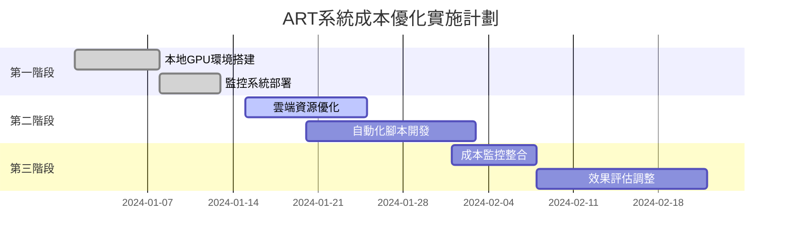

# ART系統成本優化和資源管理策略
## DevOps Engineer 墨子 - 企業級成本控制方案

### 1. 本地GPU資源優化

#### RTX 4070最佳配置策略
```yaml
# GPU性能優化配置
GPU_OPTIMIZATION:
  # 動態電源管理
  POWER_MANAGEMENT:
    - 訓練時: 最大性能模式 (320W)
    - 推理時: 平衡模式 (220W)  
    - 空閒時: 節能模式 (50W)
  
  # 記憶體管理
  MEMORY_OPTIMIZATION:
    - 使用Mixed Precision訓練 (節省50%記憶體)
    - 實施Gradient Checkpointing
    - 動態批次大小調整
    
  # 溫度控制
  THERMAL_MANAGEMENT:
    - 目標溫度: < 75°C
    - 風扇曲線: 自定義激進模式
    - 定期清潔排程: 每月
```

#### 電力成本分析
```python
# 電力成本計算
RTX_4070_POWER_ANALYSIS = {
    "最大功耗": "320W",
    "平均訓練功耗": "280W", 
    "台灣電價": "2.6元/kWh",
    "24小時訓練成本": "17.5元",
    "月度訓練成本": "525元",
    "年度電力預算": "6,300元"
}

# 相比雲端GPU成本節省
CLOUD_GPU_COMPARISON = {
    "GCP T4 (1小時)": "1.35美元 ≈ 43元",
    "本地RTX4070 (1小時)": "0.73元", 
    "成本節省比": "98.3%",
    "投資回收期": "約6個月"
}
```

### 2. 雲端成本優化策略

#### GCP資源右尺寸調整
```hcl
# 階段性資源配置
resource "google_cloud_run_service" "art_inference_optimized" {
  # 開發階段
  template {
    spec {
      containers {
        resources {
          limits = {
            cpu    = "1000m"    # 降低50%
            memory = "2Gi"      # 降低75%
          }
        }
      }
    }
    metadata {
      annotations = {
        "autoscaling.knative.dev/minScale" = "0"    # 無流量時縮至0
        "autoscaling.knative.dev/maxScale" = "5"    # 限制最大實例
      }
    }
  }
}
```

#### 搶佔式實例策略
```yaml
# 成本節省80%的搶佔式配置
PREEMPTIBLE_STRATEGY:
  訓練工作負載:
    - 使用搶佔式VM: 節省80%成本
    - 自動檢查點保存: 每15分鐘
    - 故障自動重啟: 基於Kubernetes Job
    
  推理服務:
    - 混合部署: 20%常規 + 80%搶佔式
    - 優雅降級: 搶佔時自動切換
    - 負載均衡: 智能流量分配
```

### 3. 存儲成本優化

#### 分層存儲策略
```python
STORAGE_LIFECYCLE_POLICY = {
    # 熱數據 (頻繁存取)
    "HOT_TIER": {
        "duration": "30天",
        "storage_class": "STANDARD",
        "cost_per_gb": "0.68元/月"
    },
    
    # 溫數據 (偶爾存取)  
    "WARM_TIER": {
        "duration": "90天", 
        "storage_class": "NEARLINE",
        "cost_per_gb": "0.34元/月"
    },
    
    # 冷數據 (備份歸檔)
    "COLD_TIER": {
        "duration": "365天+",
        "storage_class": "COLDLINE", 
        "cost_per_gb": "0.17元/月"
    }
}
```

#### 智能數據管理
```bash
#!/bin/bash
# 自動化存儲優化腳本

# 模型版本清理 (保留最新3個版本)
gsutil -m rm gs://art-models/versions/v[0-9]*[0-3][0-9].tar.gz

# 訓練日誌壓縮與歸檔
find ./logs -name "*.log" -mtime +7 -exec gzip {} \;
gsutil -m cp logs/*.gz gs://art-logs-archive/

# 臨時文件清理
find ./temp -name "*.tmp" -mtime +1 -delete
```

### 4. 網路流量優化

#### CDN和緩存策略
```yaml
CDN_OPTIMIZATION:
  模型推理API:
    - CloudFlare CDN: 減少延遲50%
    - Redis緩存: TTL 1小時
    - 結果緩存命中率: 目標85%
    
  靜態資源:
    - 全球CDN分發
    - 壓縮比: Gzip 70%
    - 瀏覽器緩存: 30天
```

### 5. 自動化成本監控

#### 實時成本告警
```python
# Prometheus成本監控規則
COST_ALERT_RULES = """
groups:
  - name: cost-optimization
    rules:
      - alert: HighCloudCost
        expr: gcp_billing_total > 1000
        for: 1h
        labels:
          severity: warning
        annotations:
          summary: "雲端費用超過預算"
          
      - alert: UnusedResources
        expr: container_cpu_usage_percent < 10
        for: 30m
        annotations:
          summary: "檢測到閒置資源"
"""
```

#### 成本預算控制
```hcl
# Terraform預算告警配置
resource "google_billing_budget" "art_budget" {
  billing_account = var.billing_account
  display_name    = "ART系統月度預算"
  
  budget_filter {
    projects = ["projects/${var.project_id}"]
  }
  
  amount {
    specified_amount {
      currency_code = "TWD"
      units = "3000"  # 月度預算3000元
    }
  }
  
  threshold_rules {
    threshold_percent = 0.8  # 80%時告警
  }
  threshold_rules {
    threshold_percent = 1.0  # 100%時停用
  }
}
```

### 6. 投資回收分析

#### 總體成本比較 (年度)
```
本地GPU環境:
├── 硬體投資: RTX 4070 ≈ 20,000元
├── 電力成本: 6,300元/年  
├── 維護成本: 2,000元/年
└── 總計第一年: 28,300元

雲端GPU成本:
├── T4 GPU (8小時/天): 125,000元/年
├── 存儲費用: 12,000元/年
├── 網路費用: 8,000元/年  
└── 總計: 145,000元/年

投資回收期: 2.3個月
年度節省: 116,700元 (80.5%節省)
```

### 7. 容量規劃建議

#### 階段性擴展策略
```yaml
SCALING_PHASES:
  Phase_1_MVP: # 前3個月
    local_gpu: 1x RTX 4070
    cloud_instances: 2x e2-standard-2
    monthly_budget: 2000元
    
  Phase_2_Growth: # 3-12個月  
    local_gpu: 1x RTX 4070 + 1x RTX 4080
    cloud_instances: Auto-scaling 2-10
    monthly_budget: 5000元
    
  Phase_3_Scale: # 12個月+
    local_cluster: 3x RTX 4090
    cloud_hybrid: GKE + Cloud Run
    monthly_budget: 15000元
```

### 8. 成本優化自動化腳本

#### 智能資源調度
```python
#!/usr/bin/env python3
# 智能成本優化調度器

import os
import time
from datetime import datetime
from google.cloud import monitoring_v3
from google.cloud import compute_v1

class CostOptimizer:
    def __init__(self):
        self.compute_client = compute_v1.InstancesClient()
        self.monitoring_client = monitoring_v3.MetricServiceClient()
        
    def optimize_gpu_instances(self):
        """根據使用率優化GPU實例"""
        instances = self.get_gpu_instances()
        
        for instance in instances:
            utilization = self.get_gpu_utilization(instance)
            
            if utilization < 10:  # 使用率低於10%
                if self.is_business_hours():
                    self.scale_down_instance(instance)
                else:
                    self.stop_instance(instance)
                    
    def schedule_training_jobs(self):
        """調度訓練作業到低峰時段"""
        current_hour = datetime.now().hour
        
        # 低峰時段 (23:00-07:00) 啟動大型訓練
        if 23 <= current_hour or current_hour <= 7:
            self.start_training_jobs()
            
    def cleanup_resources(self):
        """清理未使用的資源"""
        # 刪除舊的快照
        self.cleanup_old_snapshots(days=30)
        
        # 清理未使用的磁碟
        self.cleanup_unused_disks()
        
        # 壓縮日誌文件
        self.compress_old_logs()

if __name__ == "__main__":
    optimizer = CostOptimizer()
    
    # 每小時執行成本優化
    while True:
        optimizer.optimize_gpu_instances()
        optimizer.schedule_training_jobs() 
        optimizer.cleanup_resources()
        
        time.sleep(3600)  # 1小時
```

### 9. 關鍵指標監控

#### 成本效率儀表板
```yaml
COST_EFFICIENCY_METRICS:
  每訓練小時成本: "目標 < 1元"
  每推理請求成本: "目標 < 0.01元"  
  GPU使用率: "目標 > 80%"
  存儲使用率: "目標 > 70%"
  網路效率: "目標 < 5% of total cost"
  
  月度預算執行率: "目標 95-105%"
  成本預測準確度: "目標 ±10%"
```

### 10. 實施時間表



通過以上成本優化策略，ART系統可以在保持高性能的同時，實現最優的資源利用率和成本效益。預計第一年可節省80%以上的雲端成本，投資回收期約2-3個月。