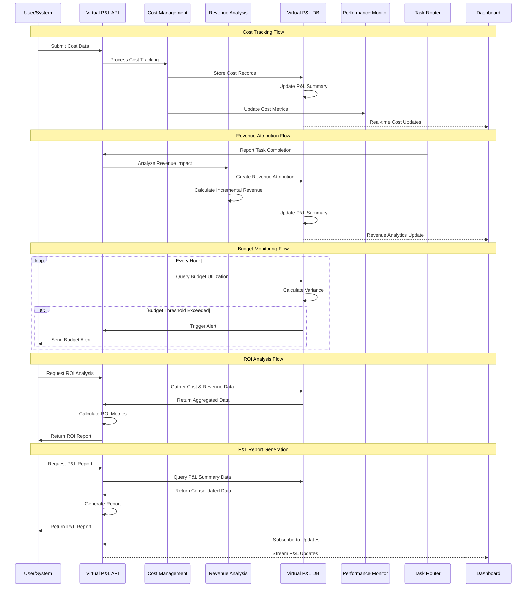

# GPT-OSS虛擬損益表系統架構設計

## 系統概述

GPT-OSS虛擬損益表系統是一個企業級財務管理系統，專為追蹤和分析GPT-OSS本地推理服務的成本效益而設計。系統提供完整的成本追蹤、收益歸因、預算管理和ROI分析功能。

## 核心架構組件

### 1. 數據模型架構

```mermaid
classDiagram
    class CostCenter {
        +UUID id
        +String code
        +String name
        +String description
        +UUID parent_id
        +Integer level
        +String path
        +String manager
        +String department
        +Boolean has_budget_authority
        +Decimal budget_limit
        +Boolean is_active
        +DateTime created_at
        +DateTime updated_at
        
        +create_child_center(data)
        +get_hierarchy()
        +calculate_total_budget()
    }
    
    class CostTracking {
        +UUID id
        +UUID cost_center_id
        +Date record_date
        +Integer period_year
        +Integer period_quarter
        +Integer period_month
        +String cost_category
        +String cost_type
        +String cost_subcategory
        +Decimal amount
        +String currency
        +String description
        +JSON cost_details
        +String allocation_method
        +Decimal allocation_basis
        +Decimal allocation_percentage
        +String source_system
        +String source_reference
        +String transaction_id
        +DateTime created_at
        +String created_by
        
        +calculate_allocation()
        +validate_amount()
        +get_period_summary()
    }
    
    class RevenueAttribution {
        +UUID id
        +Date record_date
        +Integer period_year
        +Integer period_quarter
        +Integer period_month
        +String revenue_source
        +String revenue_subcategory
        +Decimal amount
        +String currency
        +String attribution_method
        +Decimal attribution_confidence
        +Decimal gpt_oss_contribution_ratio
        +String customer_id
        +String customer_tier
        +String product_feature
        +String description
        +JSON revenue_details
        +String baseline_period
        +Decimal baseline_amount
        +Decimal incremental_amount
        +DateTime created_at
        +String created_by
        
        +calculate_incremental_revenue()
        +validate_attribution()
        +get_confidence_analysis()
    }
    
    class BudgetAllocation {
        +UUID id
        +UUID cost_center_id
        +Integer budget_year
        +String budget_period_type
        +Integer budget_period
        +Decimal total_budget
        +String currency
        +Decimal hardware_budget
        +Decimal infrastructure_budget
        +Decimal power_budget
        +Decimal personnel_budget
        +Decimal maintenance_budget
        +Decimal software_budget
        +Decimal other_budget
        +Decimal revenue_target
        +Decimal cost_savings_target
        +Decimal roi_target
        +String budget_status
        +Integer approval_level
        +String description
        +JSON budget_details
        +JSON assumptions
        +DateTime created_at
        +String created_by
        
        +validate_budget_distribution()
        +calculate_utilization()
        +check_approval_required()
    }
    
    class InternalBilling {
        +UUID id
        +String billing_id
        +Date billing_date
        +Integer billing_year
        +Integer billing_quarter
        +Integer billing_month
        +UUID provider_cost_center_id
        +UUID consumer_cost_center_id
        +String service_type
        +String service_category
        +String service_description
        +String usage_metric
        +Decimal usage_quantity
        +Decimal unit_rate
        +Decimal base_amount
        +Decimal discount_amount
        +Decimal tax_amount
        +Decimal total_amount
        +String currency
        +String allocation_method
        +JSON allocation_details
        +String billing_status
        +Date due_date
        +Date paid_date
        +DateTime created_at
        +String created_by
        
        +calculate_billing_amount()
        +apply_discounts()
        +generate_invoice()
    }
    
    class VirtualPnLSummary {
        +UUID id
        +UUID cost_center_id
        +Date summary_date
        +Integer period_year
        +Integer period_quarter
        +Integer period_month
        +String period_type
        +Decimal total_costs
        +Decimal hardware_costs
        +Decimal infrastructure_costs
        +Decimal power_costs
        +Decimal personnel_costs
        +Decimal maintenance_costs
        +Decimal software_costs
        +Decimal cloud_fallback_costs
        +Decimal other_costs
        +Decimal total_revenues
        +Decimal membership_revenue
        +Decimal alpha_engine_revenue
        +Decimal api_usage_revenue
        +Decimal cost_savings_revenue
        +Decimal other_revenue
        +Decimal gross_profit
        +Decimal net_profit
        +Decimal profit_margin
        +Decimal roi
        +Decimal cost_per_token
        +Decimal revenue_per_user
        +Decimal cost_savings_ratio
        +Decimal budget_variance_cost
        +Decimal budget_variance_revenue
        +Decimal budget_utilization
        +Integer total_tokens_processed
        +Integer total_requests_served
        +Integer active_users_count
        +String currency
        +Boolean is_consolidated
        +DateTime generated_at
        +String generated_by
        
        +calculate_profit_metrics()
        +calculate_roi()
        +generate_variance_analysis()
        +consolidate_children()
    }
    
    CostCenter ||--o{ CostCenter : "parent-child"
    CostCenter ||--o{ CostTracking : "tracks costs"
    CostCenter ||--o{ BudgetAllocation : "has budgets"
    CostCenter ||--o{ VirtualPnLSummary : "summarized in"
    CostCenter ||--o{ InternalBilling : "provider"
    CostCenter ||--o{ InternalBilling : "consumer"
    CostTracking }o--|| VirtualPnLSummary : "aggregated in"
    RevenueAttribution }o--|| VirtualPnLSummary : "aggregated in"
    BudgetAllocation }o--|| VirtualPnLSummary : "compared in"
```

### 2. 服務層架構

```mermaid
classDiagram
    class VirtualPnLDB {
        -Logger logger
        -SessionLocal session_factory
        
        +create_cost_center(data)
        +create_cost_tracking(data)
        +create_revenue_attribution(data)
        +create_budget_allocation(data)
        +get_cost_analysis(request)
        +get_pnl_report(filters)
        +calculate_roi_analysis(request)
        +calculate_incremental_revenue(params)
        +get_budget_utilization(filters)
        +batch_create_cost_tracking(data_list)
        +health_check()
        -_update_pnl_summary_for_period(params)
        -_calculate_cost_trends(data)
        -_generate_roi_recommendations(metrics)
    }
    
    class CostManagementService {
        -VirtualPnLDB pnl_db
        -TaskMetadataDB task_db
        -ModelCapabilityDB model_db
        
        +track_inference_costs(session_data)
        +allocate_hardware_costs(allocation_data)
        +calculate_power_costs(usage_metrics)
        +track_personnel_costs(time_tracking)
        +process_maintenance_costs(maintenance_data)
        +generate_cost_allocation_report(period)
    }
    
    class RevenueAnalysisService {
        -VirtualPnLDB pnl_db
        -UserManagementDB user_db
        -SubscriptionDB subscription_db
        
        +attribute_membership_upgrades(upgrade_data)
        +track_alpha_engine_revenue(usage_data)
        +calculate_api_usage_fees(consumption_data)
        +analyze_cost_savings(comparison_data)
        +generate_revenue_attribution_report(period)
    }
    
    class BudgetManagementService {
        -VirtualPnLDB pnl_db
        -NotificationService notification_service
        
        +create_budget_plan(budget_data)
        +monitor_budget_utilization()
        +generate_budget_alerts()
        +perform_budget_variance_analysis(period)
        +forecast_budget_requirements(projection_data)
    }
    
    class ROIAnalysisService {
        -VirtualPnLDB pnl_db
        -PerformanceMonitor performance_monitor
        -CostBenchmarkDB benchmark_db
        
        +calculate_comprehensive_roi(analysis_request)
        +perform_cost_benefit_analysis(comparison_data)
        +generate_investment_recommendations()
        +calculate_payback_period(investment_data)
        +analyze_cost_savings_vs_cloud(comparison_period)
    }
    
    class InternalBillingService {
        -VirtualPnLDB pnl_db
        -AITaskRouter task_router
        
        +calculate_usage_based_billing(usage_data)
        +allocate_shared_costs(allocation_rules)
        +generate_internal_invoices(billing_period)
        +process_cost_transfers(transfer_data)
        +reconcile_internal_accounts()
    }
    
    VirtualPnLDB ||--o{ CostManagementService : uses
    VirtualPnLDB ||--o{ RevenueAnalysisService : uses
    VirtualPnLDB ||--o{ BudgetManagementService : uses
    VirtualPnLDB ||--o{ ROIAnalysisService : uses
    VirtualPnLDB ||--o{ InternalBillingService : uses
```

### 3. 系統集成架構

```mermaid
graph TB
    subgraph "Virtual P&L System"
        VPL[Virtual P&L Core]
        CM[Cost Management]
        RA[Revenue Analysis]
        BM[Budget Management]
        ROI[ROI Analysis]
        IB[Internal Billing]
    end
    
    subgraph "GPT-OSS Integration Layer"
        TR[Task Router]
        PM[Performance Monitor]
        MC[Model Capability DB]
        TM[Task Metadata DB]
    end
    
    subgraph "Business Systems"
        UM[User Management]
        SUB[Subscription System]
        PAY[Payment System]
        NOT[Notification Service]
    end
    
    subgraph "Infrastructure Monitoring"
        HM[Hardware Monitoring]
        PWR[Power Monitoring]
        NW[Network Monitoring]
        SEC[Security Monitoring]
    end
    
    subgraph "External Data Sources"
        CLOUD[Cloud Provider APIs]
        BENCH[Benchmark Data]
        MARKET[Market Data]
    end
    
    subgraph "Reporting & Analytics"
        DASH[Management Dashboard]
        REP[Report Generator]
        ALERT[Alert System]
        EXPORT[Data Export]
    end
    
    %% Core integrations
    VPL --> CM
    VPL --> RA
    VPL --> BM
    VPL --> ROI
    VPL --> IB
    
    %% GPT-OSS integrations
    CM --> TR
    CM --> PM
    RA --> MC
    RA --> TM
    
    %% Business system integrations
    RA --> UM
    RA --> SUB
    IB --> PAY
    BM --> NOT
    
    %% Infrastructure monitoring
    CM --> HM
    CM --> PWR
    CM --> NW
    CM --> SEC
    
    %% External data
    ROI --> CLOUD
    ROI --> BENCH
    RA --> MARKET
    
    %% Reporting outputs
    VPL --> DASH
    VPL --> REP
    BM --> ALERT
    VPL --> EXPORT
    
    style VPL fill:#e1f5fe
    style TR fill:#fff3e0
    style DASH fill:#f3e5f5
```



### 4. 數據流架構



## 關鍵設計模式

### 1. Repository Pattern
- `VirtualPnLDB` 類作為數據訪問層
- 封裝所有數據庫操作邏輯
- 提供統一的數據訪問接口

### 2. Service Layer Pattern
- 各個專門的服務類處理業務邏輯
- 分離關注點（成本管理、收益分析、預算管理等）
- 支持依賴注入和單元測試

### 3. Observer Pattern
- P&L摘要自動更新機制
- 預算超支警報系統
- 實時儀表板更新

### 4. Strategy Pattern
- 多種成本分攤方法
- 不同的收益歸因策略
- 靈活的ROI計算方式

### 5. Factory Pattern
- 成本追蹤記錄創建
- 報告生成器工廠
- 分析請求處理器

## 數據完整性保證

### 1. 約束檢查
- 金額必須為正數
- 期間值合理性檢查
- 分攤比例總和驗證

### 2. 事務管理
- 成本記錄和P&L摘要的原子性更新
- 預算分配的一致性保證
- 收益歸因的完整性驗證

### 3. 審計追蹤
- 所有財務記錄的創建者跟踪
- 修改歷史記錄
- 審批流程記錄

## 性能優化策略

### 1. 數據庫索引優化
- 時間維度索引（年、季、月）
- 成本中心路徑索引
- 複合索引優化查詢性能

### 2. 數據預聚合
- P&L摘要表預計算
- 定期批量更新機制
- 增量更新策略

### 3. 快取策略
- 頻繁查詢結果快取
- 預算利用率快取
- ROI分析結果快取

### 4. 異步處理
- 批量成本記錄處理
- 背景P&L摘要更新
- 非同步報告生成

## 安全考慮

### 1. 數據訪問控制
- 基於角色的成本中心訪問
- 財務數據敏感性分級
- 審計記錄保護

### 2. 數據完整性
- 輸入驗證和清理
- SQL注入防護
- 數據加密存儲

### 3. 審計合規
- 完整的操作日誌
- 變更追蹤機制
- 合規報告生成

## 擴展性設計

### 1. 水平擴展
- 數據庫分片策略
- 讀寫分離架構
- 負載均衡支持

### 2. 功能擴展
- 插件式分析模組
- 可配置的成本分類
- 自定義報告模板

### 3. 集成擴展
- 標準API接口
- Webhook支持
- 第三方系統集成